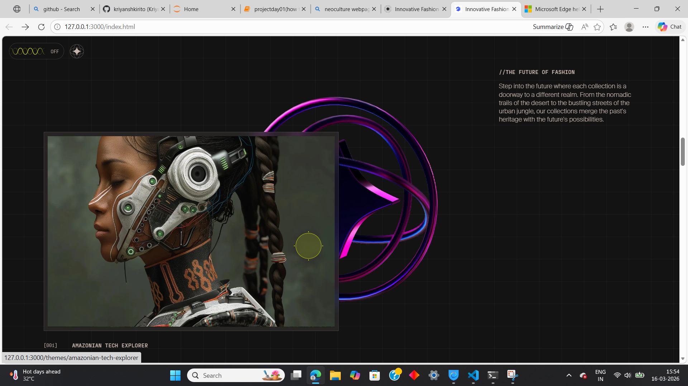
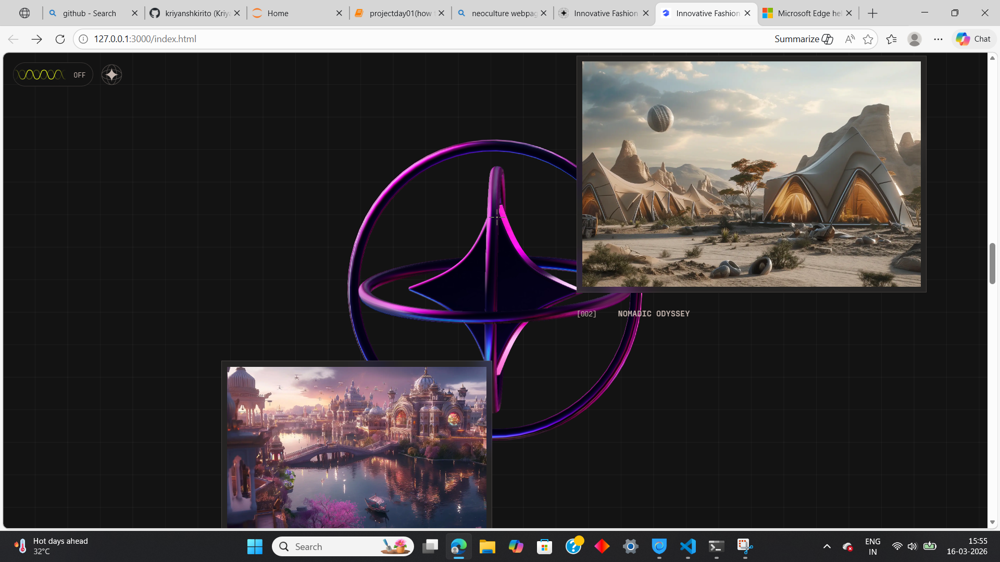
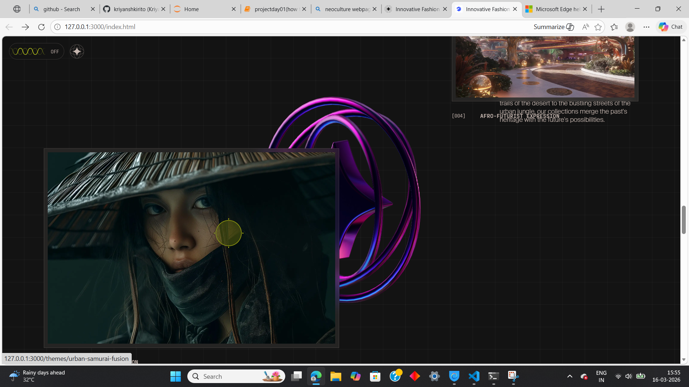

Day 01 – NeoCulture Website Copy (Python Web Scraping)

📌 Project Overview
This project is part of my daily coding project series.
In Day 01, I experimented with Python web scraping to copy the structure of the NeoCulture website.

Using Python libraries, I fetched the webpage content and recreated the website locally for learning and educational purposes.

The goal of this project was to understand:

How websites are structured in HTML

How Python can extract webpage content

How web scraping tools work

🚀 Features
Extracts webpage structure using Python

Parses HTML using BeautifulSoup

Saves webpage content locally

Helps understand real website layouts

Beginner-friendly web scraping project 

🛠️ Technologies Used
Python

BeautifulSoup

Requests

HTML

📷 Project Screenshots
Screenshot 1

Screenshot 2

Screenshot 3

Screenshot 4

Screenshot 5

Screenshot 6

Screenshot 7

🎥 Demo Video 
 
 kindly go through video file

<video controls src="../../Video Project.mp4" title="Title"></video>

