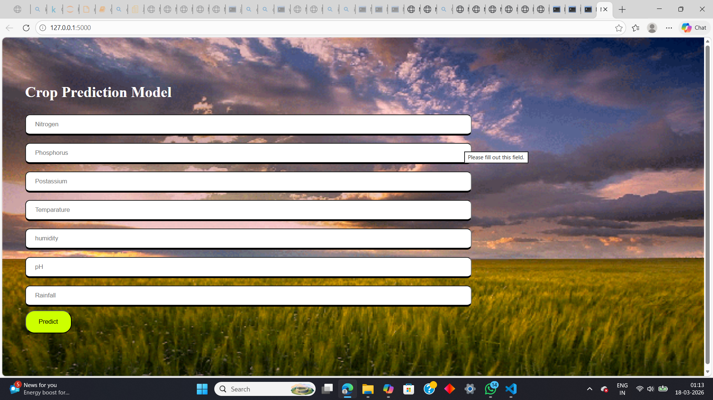
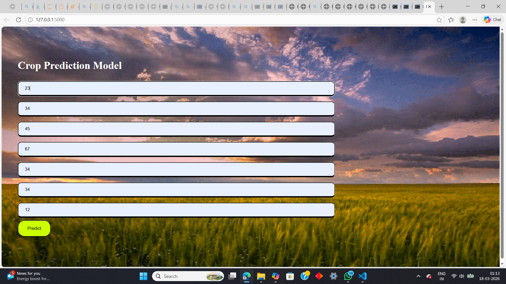
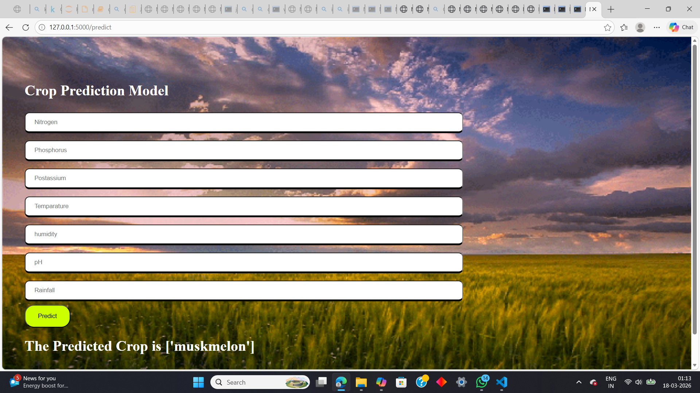

🌾 Crop Prediction ML Model

A Machine Learning based web application that predicts the most suitable crop to grow based on soil nutrients and environmental conditions.

This project uses a trained machine learning model with a simple web interface where users can enter soil and weather parameters to get crop recommendations.

---

🚀 Features

Predict best crop based on soil nutrients

Simple and interactive web interface

Machine learning model integration

Fast predictions using Flask backend

Easy to use input form

---

🧠 Technologies Used

Python

Flask

Machine Learning

HTML

CSS

Scikit-learn

NumPy / Pandas

Used Kaggle DataSet

---

📊 Input Parameters

The model takes the following inputs:

Nitrogen

Phosphorus

Potassium

Temperature

Humidity

pH

Rainfall

Based on these inputs, the model predicts the best crop for cultivation.

---

🏗 Project Structure

Crop-Prediction-Model
│
├── app.py
├── model.pkl
├── cropPrediction.py
│
├── templates
│   └── index.html
│
├── static
│   ├── style.css
│   └── images
│
└── README.md

---

📸 Project Screenshots

Screenshot 1

Screenshot 2

Screenshot 3

---

⚙️ How to Run the Project

1️⃣ Clone the repository

git clone https://github.com/your-username/crop-prediction-ml.git

2️⃣ Go to project folder

cd crop-prediction-ml

3️⃣ Install dependencies

pip install -r requirements.txt

4️⃣ Run the Flask application

python app.py

5️⃣ Open browser

http://127.0.0.1:5000/

---

📈 Future Improvements

Deploy the model online

Improve UI design

Add more crop datasets

Add graphical analytics

Mobile responsive interface

---

🙏 Credits

This project was developed using open-source resources and inspiration to not let the streak break.

---

⭐ Support

If you like this project:

Give it a ⭐ on GitHub

Share it with others

Fork the repository

---

