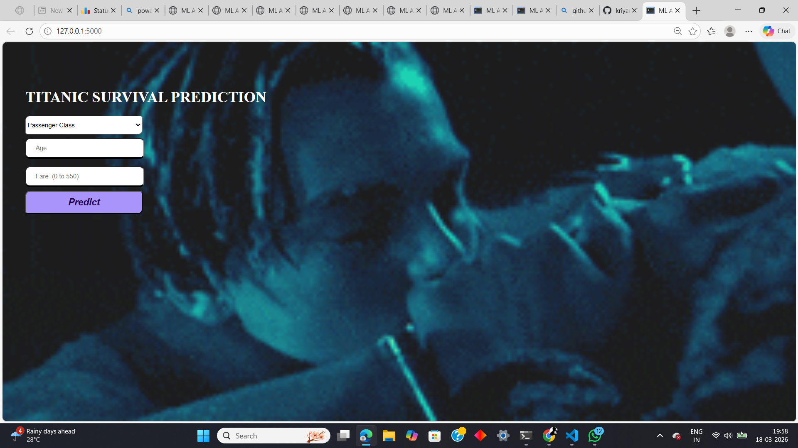
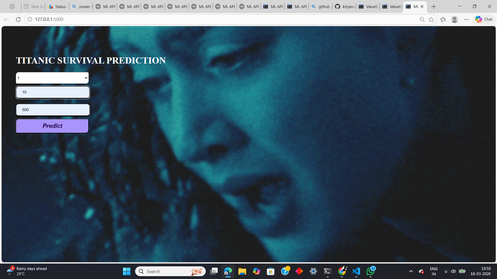
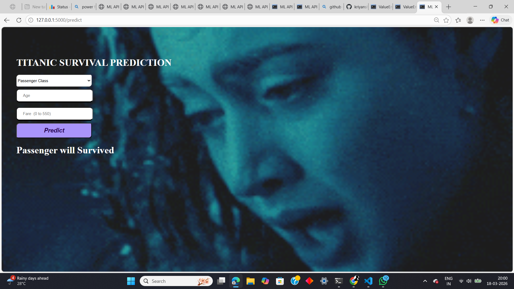
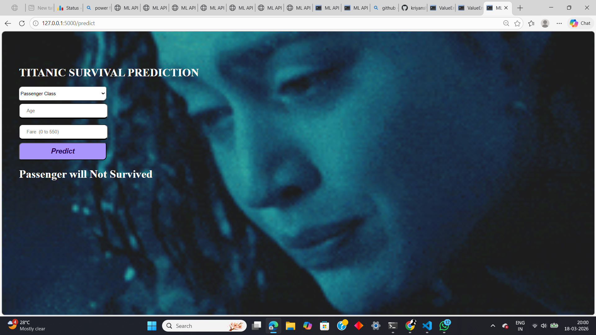

🚢 Titanic Survival Prediction Web App

A simple Machine Learning web application that predicts whether a passenger would survive the Titanic disaster based on input features like Age, Fare, and Passenger Class.

---

📌 Project Overview

This project uses a trained ML model to predict survival outcomes and displays the result through a web interface built using Flask.

---

⚙️ Features

Predict survival using:

Age

Fare

Passenger Class (Pclass)

Simple and clean UI

Real-time prediction

Lightweight Flask backend

---

🧠 Machine Learning Model

Algorithm: Random Forest Classifier (or your model)

Libraries used:

NumPy

Pandas

Scikit-learn

Pickle (for model saving)

---

🛠️ Tech Stack

Frontend: HTML, CSS

Backend: Flask (Python)

ML Libraries: Scikit-learn, NumPy, Pandas

---

📂 Project Structure

project/
│── static/            # CSS files
│── templates/         # HTML files
│── model.pkl          # Trained model
│── app.py             # Flask app
│── README.md

---

🚀 How to Run Locally

1️⃣ Clone the repository

git clone (link)
cd titanic-survival

2️⃣ Install dependencies

pip install -r requirements.txt

(or manually install: flask, numpy, pandas, scikit-learn)

---

3️⃣ Run the app

python app.py

---

4️⃣ Open in browser

---

📸 Output Screenshots

Screenshot 1

Screenshot 2

Screenshot 3

Screenshot 4

---

🎥 Demo Video

(Add your video link here)

---

📊 Example Output

Input: Age = 25, Fare = 100, Class = 1

Output: Survived

---

⚠️ Common Issues

Make sure model.pkl is in the same directory as app.py

Ensure all libraries are installed

Use compatible Python version (3.10 / 3.11 recommended)

---

🙌 Acknowledgement

Titanic dataset from Kaggle

Inspired by basic ML projects

---

📌 Future Improvements

Add more features (Gender, SibSp, Parch)

Improve UI design

Deploy on cloud (Render / Heroku)

---

⭐ If you like this project

Give it a star ⭐ on GitHub!

---

If you want, I can also: ✅ Customize README with your name + GitHub link
✅ Add badges + deployment section
✅ Make it look like a top-level professional repo 🚀