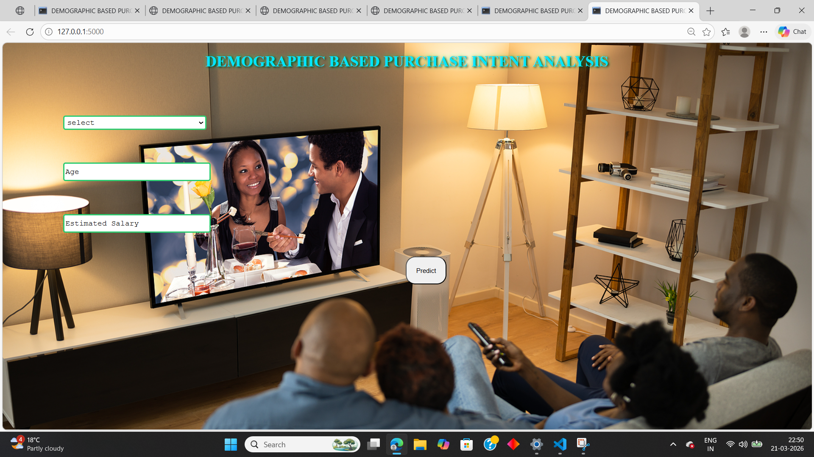
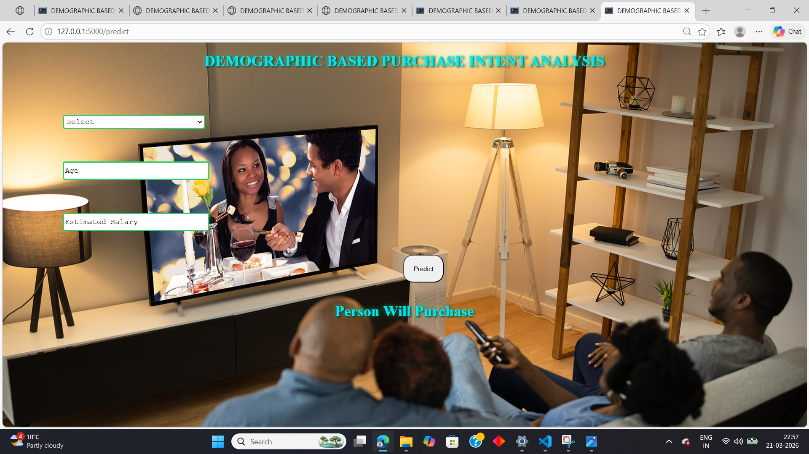
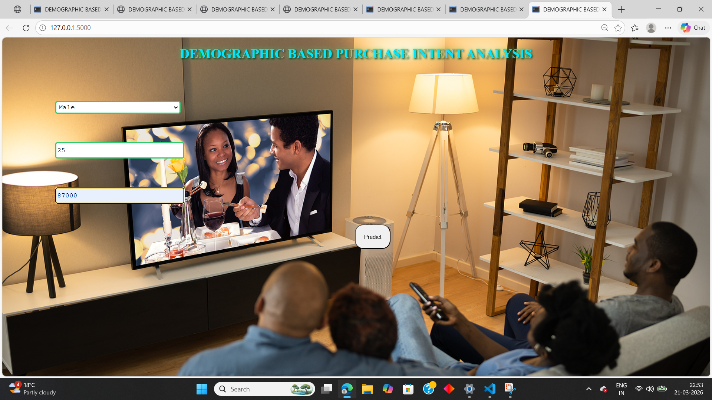
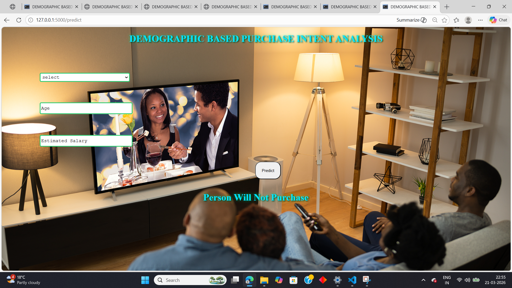

🎯 <h1>Social Network Ad Conversion Predictor<h1>

A machine learning-powered web application that predicts whether a user will purchase a product based on their demographic data (Age, Estimated Salary, and Gender). This tool helps digital marketers target the right audience and optimize ad spend.

🚀 <h2>Features<h2>
 * Predictive Analysis: Uses a trained Machine Learning model (pipe.pkl) to classify purchase intent.
 * Modern Web UI: A forest-themed, dark-mode interface with frosted-glass effects.
 * Dynamic UX: Prediction results appear with neon styling and automatically vanish after 5 seconds for a clean user experience.
 * Responsive Design: Works on both desktop and mobile browsers.

🛠️ <h2>Tech Stack<h2>
 * Backend: Python & Flask
 * Machine Learning: Scikit-Learn, Pandas, NumPy
 * Frontend: HTML5, CSS3 (Advanced Filtering & Blurring), JavaScript (DOM Manipulation)
 * Deployment: Pickle (Model Serialization)
<h2>Screenshot<h2>

 <h3>Screenshot 1<h3>

 <h3>Screenshot 2<h3>

 

 <h3>Screenshot 3<h3>

 

 <h3>Screenshot 4<h3>

 

📂 Project Structure
├── app.py              # Flask Backend Logic
├── pipe.pkl            # Trained Machine Learning Model
├── static/
│   ├── css/            # Custom Styling
│   └── imgd5.jpg       # Forest Background Image
└── templates/
    └── index.html      # Main User Interface

⚙️ <h2>Installation & Setup<h2>
 * Clone the repository:

 * Install dependencies:
   pip install flask numpy pandas scikit-learn

 * Run the application:
   python app.py

 * Access the app:
   Open your browser and go to http://127.0.0.1:5000/
📊 <h2>Data Insights<h2>
The model is trained on the "Social Network Ads" dataset. Key features include:
 * Age: The age of the potential customer.
 * Estimated Salary: Annual income of the user.
 * Gender: Categorical data mapped to (Male: 1, Female: 0).
