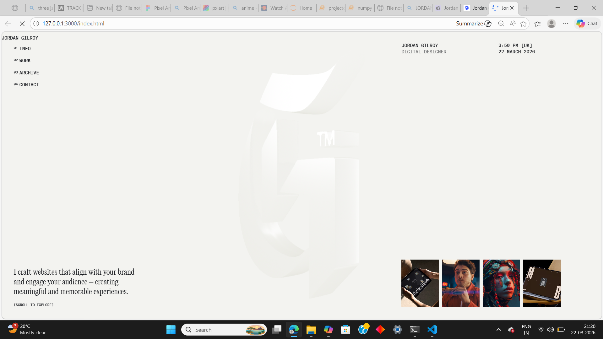
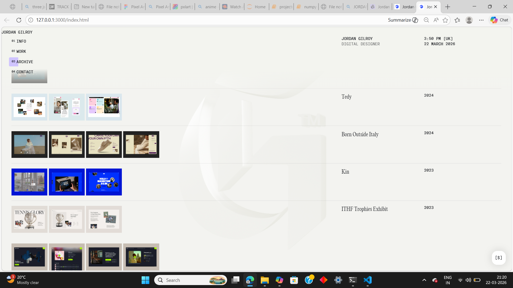

# 🕸️ Web Scraping Jordan Gilroy’s Website using Python & BeautifulSoup

This project demonstrates how to **scrape and clone the public-facing content** of Jordan Gilroy’s website using Python’s `requests` and `BeautifulSoup` libraries.  
It is intended purely for **educational and personal learning** about web scraping, HTML parsing, and automated content extraction.

---

## 📌 Features

- Fetches HTML content from Jordan Gilroy’s website  
- Parses and extracts:
  - Text content  
  - Images  
  - Links  
  - Metadata  
- Saves the scraped data into organized local folders  
- Clean, modular Python code  
- Error‑handled scraping pipeline  
- Fully open-source and easy to extend  

---

## ⚠️ Legal & Ethical Disclaimer

This project is for **educational purposes only**.  
Always check a website’s **robots.txt** and **Terms of Service** before scraping.  
Do not use scraped content for commercial or harmful purposes.

---

## Screenshot








<video controls src="screenshot/Screen Recording 2026-03-22 212412.mp4" title="Title"></video>


## 🛠️ Tech Stack

| Tool | Purpose |
|------|---------|
| **Python 3.x** | Main programming language |
| **Requests** | Fetching website HTML |
| **BeautifulSoup (bs4)** | Parsing and extracting data |
| **OS / Pathlib** | Saving files locally |

---

## 📂 Project Structure

```
📁 jordan-gilroy-scraper
 ├── scraper.py
 ├── utils.py
 ├── requirements.txt
 ├── README.md
 └── output/
      ├── index.html
      ├── images/
      └── assets/
```

---

## 🚀 Getting Started

### 1. Clone the repository


### 2. Install dependencies

```bash
pip install -r requirements.txt
```

### 3. Run the scraper

```bash
python scraper.py
```

After running, all scraped content will appear inside the `output/` folder.

---

## 🧠 How It Works

### Step 1 — Send HTTP Request  
The script sends a GET request to Jordan Gilroy’s website.

### Step 2 — Parse HTML  
BeautifulSoup parses the HTML into a searchable tree.

### Step 3 — Extract Content  
The scraper collects:

- Page title  
- Paragraphs  
- Images  
- Internal links  

### Step 4 — Save Locally  
HTML and assets are saved into the `output/` directory, recreating the site structure.

---


## 🧩 Future Improvements

- Add multi-page crawling  
- Download CSS & JS files  
- Add sitemap-based scraping  
- Export data to JSON or CSV  
- Build a GUI version  

---

## 🤝 Contributing

Pull requests are welcome.  
If you want to add features or improve the scraper, feel free to fork the repo and submit a PR.

---

## ⭐ Support

If this project helped you learn web scraping, consider giving the repo a **star**.  
It motivates further development and improvements.

---

If you want, I can also generate:

- The full `scraper.py` file  
- A `requirements.txt`  
- A version of the README with images, badges, or a more aesthetic layout  

Just tell me what style you prefer.
