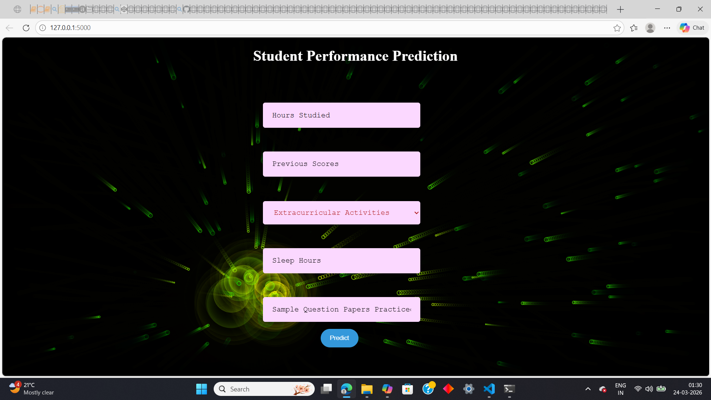
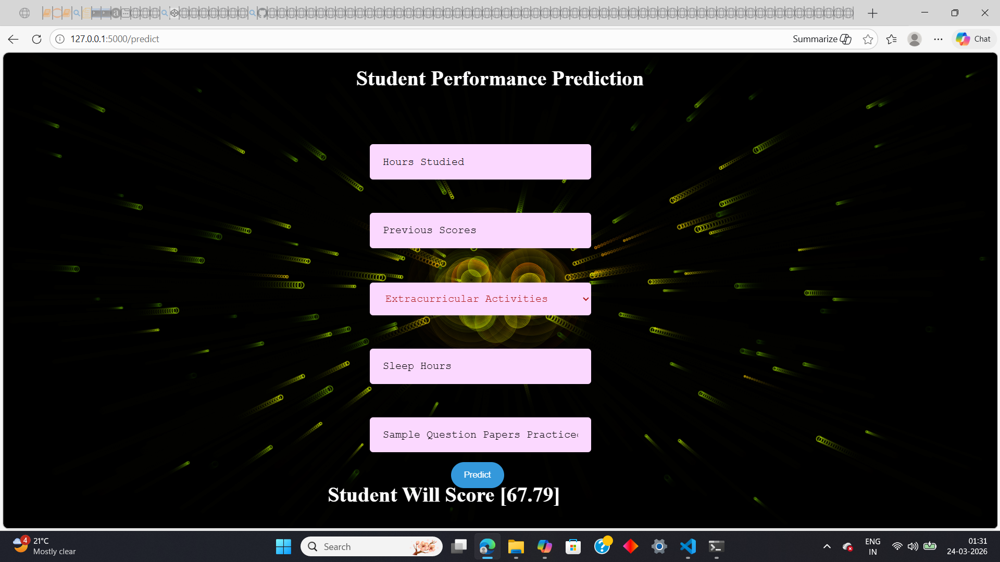

🎓 Student Performance Prediction System

An end-to-end Machine Learning web application that predicts a student’s Performance Index using academic and lifestyle factors.

This project evolves from a data science workflow (EDA → Model → Evaluation) into a fully interactive web application with a custom-built UI and real-time predictions.

---

📌 Project Highlights

🔍 End-to-end ML pipeline (Data → Model → Deployment)

🌐 Interactive Flask-based web application

🎨 Modern UI with Glassmorphism design

✨ Custom HTML5 Canvas particle engine

📊 High accuracy using regression models

---

📸 Project Preview

1️⃣ Data Analysis & Model Training

Exploratory Data Analysis (EDA), feature relationships, and model evaluation.

---

2️⃣ Interactive Web Interface

Modern UI with responsive form and animated particle background.

> 📷 

---

3️⃣ Prediction Results

Real-time predictions generated via Flask backend.

> 📷 

There is also video attached so you can see animation effect
---

🤖 Machine Learning Pipeline

🔹 Data Preprocessing

Categorical Encoding

Converted Extracurricular Activities (Yes/No) → (1/0)

Feature Scaling

Normalized continuous variables for balanced model performance

---

🔹 Model Selection

Although Performance Index appears categorical, it is actually a continuous variable (10–100).

✅ Chosen Approach: Regression

🤖 Models Used:

Random Forest Regressor

Decision Tree Regressor

---

📊 Evaluation Metric

Instead of accuracy, the model is evaluated using:

R² Score (Coefficient of Determination)
→ Measures how well predictions match actual values

✔ Achieved strong predictive performance

---

🛠️ Tech Stack

Layer	Technology

Backend	Flask (Python)
ML	Scikit-Learn, Pandas, NumPy
Frontend	HTML5, CSS3, JavaScript
UI Effects	Custom Particle Physics Engine
Deployment	Localhost (WSGI)

---

🚀 Getting Started

🔧 Prerequisites

Python 3.x

pip

---

⚙️ Installation

# Clone the repository
git clone https://github.com/your-username/student-performance-predictor.git

# Navigate to project folder
cd student-performance-predictor

# Install dependencies
pip install -r requirements.txt

# Run the application
python app.py

---

🌐 Run Locally

Open your browser and go to:

http://127.0.0.1:3000

---

💡 Key Challenges & Solutions

⚡ UI/UX Layering Issue

Problem: Particle background blocking form interaction

Solution: Fixed using z-index and pointer-events

---

📐 Model Selection Mistake

Problem: Initially used Classification

Fix: Switched to Regression after analyzing target distribution

---

🎯 Result

✔ Improved prediction accuracy
✔ Better real-world mapping of student performance

---

📈 Future Improvements

🌍 Deploy on cloud (Render / AWS / Vercel)

📊 Add more visualization dashboards

🧠 Try advanced models (XGBoost, Gradient Boosting)

🔐 Add user authentication

---

🤝 Contributing

Contributions are welcome!

# Fork the repo
# Create a new branch
# Make your changes
# Submit a Pull Request

---

📜 License

This project is open-source and available under the MIT License.

---

⭐ Support

If you found this project useful:

⭐ Star the repository
🍴 Fork it
📢 Share it

---

If you want next level upgrade, I can also:

create requirements.txt

add GitHub profile README integration

or design a portfolio-ready project card UI 🚀